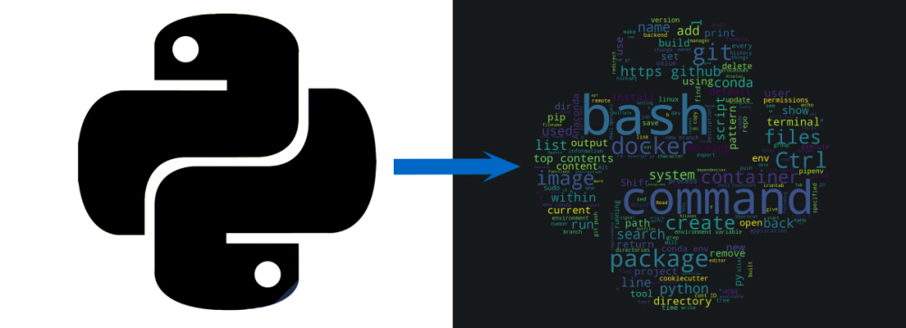

# Wordcloud

A word cloud is a visualized analysis of word frequencies. The core of this script is the [word_cloud](https://github.com/amueller/word_cloud) application. My goal was to get a word cloud which was shaped like the python symbol. I mixed a mask and the markdown file were and received a magnificent word cloud!

    

